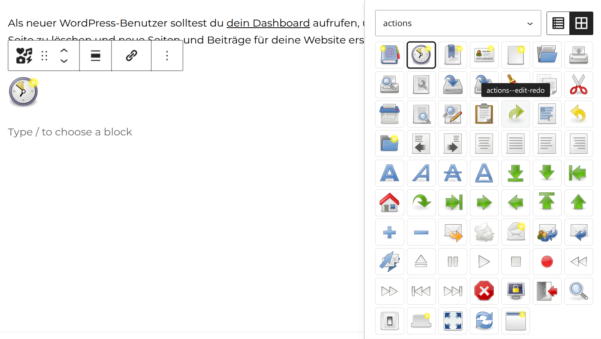

# WP Iconizer

Gutenberg plugin that inserts SVG icons from a central SVG sprite file (`ico.svg`) via `<use>` and links them. The sprite file can be uploaded directly from a settings page as an SVG fragment library.



## Features

- Settings page (Settings → WP Iconizer) for uploading the SVG sprite file, including sanitization of scripts and event handlers
- Symbol picker in the editor with a live preview of all `<symbol>` elements from the sprite
- Icons can be linked (new tab with `noopener`/`noreferrer`)
- Aria-label for screen readers
- Fill/stroke colours and width/height per block (`px`, `em`, `rem`, `%`)
- Dynamic frontend rendering via `render.php` using `get_block_wrapper_attributes()`
- Block supports: alignment, anchor, additional CSS classes

## Requirements

- Node.js LTS (>= 20.19, recommended 24 — see `.nvmrc`) and [pnpm](https://pnpm.io/) (version pinned via `packageManager` in `package.json`)
- PHP >= 8.3 (declared in `composer.json`, plugin header, and `readme.txt`)
- WordPress >= 6.6

## Development

```bash
pnpm install        # one-time
pnpm start          # build + watch (hot-reload) in the editor
pnpm run build      # production build into /build
```

Other scripts: `pnpm run lint:js`, `pnpm run lint:css`, `pnpm run typecheck`, `pnpm run format`, `pnpm run check-engines`.

> IntelliSense (VSCode/Intelephense): `php-stubs/wordpress-stubs` is installed as a dev dependency (declares the full WP API for auto-completion). The setting lives in `.vscode/settings.json` (`intelephense.files.maxSize`); after installation, run **"Intelephense: Clear Cache and Reload"** once.

> Note: `wp-scripts packages-update` uses npm internally and would write a `package-lock.json` for the `@wordpress/*` dependencies. Since this project runs on pnpm, update the WP packages with `pnpm up --latest` instead, then run `pnpm install`.

## Installation

1. Build the plugin: `pnpm install && pnpm run build`
2. Copy the plugin folder to `/wp-content/plugins/` (or create a ZIP with `pnpm run plugin-zip` and install it)
3. Activate the plugin
4. Under **Settings → WP Iconizer**, upload the `ico.svg` file containing `<symbol id="my-icon" viewBox="0 0 24 24">…</symbol>` elements (or place the sprite file directly at the configured URL)
5. In the editor, add the "SVG Fragment" block and choose an icon

## Composer installation

The plugin is packaged as a `wordpress-plugin` (`composer/installers`). Installable from the GitHub repo (development) or via the **WP Packages** repository once published:

```json
// composer.json of your WordPress project – GitHub (development)
{
    "repositories": [
        {
            "type": "vcs",
            "url": "https://github.com/svgforge/wp-iconizer.git"
        }
    ],
    "require": {
        "svgforge/wp-iconizer": "^0.1"
    }
}
```

```bash
composer require svgforge/wp-iconizer
```

Once the plugin is published in the [WordPress.org directory](https://wordpress.org/plugins/), install it via **WP Packages** — the community-run WPackagist replacement built and maintained by [Roots](https://roots.io/), used by default in current Bedrock projects:

```json
// composer.json of your WordPress project
{
    "repositories": [
        {
            "type": "composer",
            "url": "https://repo.wp-packages.org"
        }
    ],
    "require": {
        "wp-plugin/wp-iconizer": "^0.1"
    }
}
```

```bash
composer require wp-plugin/wp-iconizer
```

> WP Packages mirrors the WordPress.org directory every 5 minutes, supports the Composer v2 `metadata-url` protocol (instead of WPackagist's legacy `provider-includes` index), and offers clean `wp-plugin/*` / `wp-theme/*` naming. Migration guide: [roots/wp-packages](https://github.com/roots/wp-packages).

`composer/installers` places the plugin under `wp-content/plugins/wp-iconizer/` automatically when your project has `"type": "wordpress-plugin"` paths configured (e.g. via `extra.installer-paths`). Note: even with Composer installation, the build must be present or checked into Git before release — the release workflow builds `build/` automatically.

### Composer scripts

```bash
composer install                        # installs dev tools (Pint, PHPUnit)
composer run lint                       # Pint in check mode (--test, exit 1 on deviations)
composer run lint:fix                   # Pint auto-fix for pre-configured files/rules (pint.json)
composer run test                       # PHPUnit (needs a reachable WordPress core + MySQL, see below)
```

Configuration lives in `preset: per` in `pint.json` at the project root; generated folders like `build/` are excluded. Default setup based on [roots/bedrock](https://github.com/roots/bedrock). List used rules: `vendor/bin/pint --list`.

## Tests

PHPUnit unit tests run against the [WordPress test suite](https://make.wordpress.org/core/handbook/testing/automated-testing/phpunit/) (`wp-phpunit`) with the maintained [yoast/phpunit-polyfills](https://github.com/Yoast/PHPUnit-Polyfills). Test cases live in `tests/` (`tests/wp-tests-config.php` holds DB + core defaults, overridable via `WP_TESTS_DB_NAME`, `WP_TESTS_DB_USER`, `WP_TESTS_DB_PASSWORD`, `WP_TESTS_DB_HOST`, `WP_TESTS_WP_ROOT`).

The test suite needs a MySQL database (default `wordpress_test`) and a WordPress core checkout with the plugin available under `wp-content/plugins/wp-iconizer`. On this project's ddev site (`jdfse`), the plugin is symlinked into `web/app/plugins`, so:

```bash
cd ../jdfse && ddev mysql -e 'CREATE DATABASE IF NOT EXISTS wordpress_test'
ddev exec bash -c 'cd /var/www/html/web/app/plugins/wp-iconizer && php vendor/bin/phpunit --no-coverage'
```

In CI, point the environment variables at the service MySQL and a WP core checkout with the plugin installed there.

## Translations

User-facing strings are written in English and shipped through the text domain `wp-iconizer`. Translation files live in `languages/`: the source template `wp-iconizer.pot`, per-locale `wp-iconizer-*.po`/`.mo` and the Jed-style `.json` files that translate the block editor strings.

`de_DE` is bundled; `load_plugin_textdomain()` is hooked on `init` in `wp-iconizer.php`. To add or update a locale, rebuild the block and extract first (the POT includes the compiled `build/block/index.js`):

```bash
pnpm run build

# via WP-CLI / ddev (i18n-command), from the plugin root:
wp i18n make-pot . languages/wp-iconizer.pot --slug=wp-iconizer --ignore-domain \
    --exclude="node_modules/**,vendor/**,tests/**,.github/**,languages/**" \
    --include="src/**,wp-iconizer.php,build/block/index.js"

# fill in languages/wp-iconizer-<locale>.po (German: wp-iconizer-de_DE.po), then:
wp i18n make-mo languages
wp i18n make-json languages/wp-iconizer-<locale>.po languages --pretty-print
```

Commit the generated `.pot`, `.po`, `.mo` and `.json` files.

## Sprite file configuration

### Generating a sprite with svgforge-cli

To build a valid `ico.svg` sprite (with `<symbol id="…" viewBox="…">` elements) from a folder of SVG icons, use [svgforge-cli](https://github.com/svgforge/svgforge-cli/). The generated file can either be uploaded via the settings page or versioned as a theme file, see below.

The SVG sprite file is resolved in this order (the first existing source wins):

1. **Theme file** – Constant `WP_ICONIZER_SPRITE_FILE`, when set **and** the file exists/is readable. **Has priority.**
2. **Upload from settings** – file uploaded via the settings page (overrides the default fallback and options 3–5).
3. **Constant `WP_ICONIZER_SPRITE_URL`** – e.g. for CDN delivery.
4. **Filter `wp_iconizer_sprite_url`**.
5. **Fallback `sprite.svg`** bundled with the plugin (`wp-content/plugins/wp-iconizer/sprite.svg`).

### Theme file (recommended, Git-versionable)

In your theme's `functions.php`, point the constant to a local SVG file — the file then lives in the theme repo and is versioned with the theme:

```php
define( 'WP_ICONIZER_SPRITE_FILE', get_stylesheet_directory() . '/assets/ico.svg' );
```

The file must be readable on the server and lie within `WP_CONTENT_DIR` (e.g. `wp-content/themes/…`) or `ABSPATH`; the matching URL is derived automatically. If the file does not exist, the next source (upload, constant, filter, fallback) is used.

### Other overrides

```php
// Constant (e.g. CDN) – before the filter, after upload/theme file
define( 'WP_ICONIZER_SPRITE_URL', 'https://cdn.example.com/icons/ico.svg' );

// or filter
add_filter( 'wp_iconizer_sprite_url', function () {
    return '/wp-content/themes/my-theme/assets/ico.svg';
} );
```

> Note: Constants must be defined **before** the first access (e.g. in the theme's `functions.php` or `wp-config.php`) and may only be set once in PHP.

## Automatic release to GitHub + WordPress.org

Pushing a tag (e.g. `v0.1.0`) builds the plugin, publishes it to the wp.org directory, and creates a GitHub release with a ZIP:

```bash
git tag v0.1.0 && git push origin v0.1.0
```

The workflow `.github/workflows/release.yml` uses:
- `pnpm/action-setup` + `actions/setup-node` (cache: pnpm) → `pnpm install --frozen-lockfile`
- `pnpm run build` → production-ready `build/`
- `10up/action-wordpress-plugin-deploy@stable` → commit to wp.org SVN (trunk + tag)
- `softprops/action-gh-release@v2` → GitHub release with the generated ZIP

### Requirements for wp.org publishing

1. The plugin must already be listed in the [WordPress.org directory](https://wordpress.org/plugins/) (initial submission process with manual review).
2. `readme.txt` in the repo is required — it is used for the wp.org listing.
3. Store repo secrets (Settings → Secrets and variables → Actions):
   - `SVN_USERNAME` — your wp.org username (developer account with plugin access)
   - `SVN_PASSWORD` — your wp.org API/SVN password (not your login password)

### Assets (banners/screenshots/icons)

Optional: create a `.wordpress-org/` folder and place `banner-772x250.png`, `icon-256x256.png`, and `screenshot-1.png` there. The deploy action transfers them to the wp.org SVN `assets/` directory automatically.

Excluded development files are listed in `.distignore` (prevents `src/`, `node_modules`, etc. from being published).

## Structure

```
wp-iconizer/
├── wp-iconizer.php        Plugin bootstrap (block registration, sprite URL, i18n)
├── src/
│   ├── admin/admin.php    Settings page (SVG upload), not part of the build
│   ├── block/             Block source code
│   │   ├── block.json     Block metadata (apiVersion 3)
│   │   ├── index.tsx      registerBlockType (TypeScript)
│   │   ├── edit.tsx       Editor component (React, TypeScript)
│   │   ├── render.php     Frontend rendering (dynamic)
│   │   ├── editor.css     Editor styles
│   │   ├── style.css      Frontend styles
│   │   └── icon.svg       Block icon
│   ├── ambient.d.ts       Ambient type declarations (*.svg, *.css)
│   ├── global.d.ts        Window augmentation
│   └── types/             Manual type shims for untyped WP packages
├── build/block/           Generated (do not commit): index.js/css, block.json, render.php
├── eslint.config.js       ESLint flat config (extends WP default)
├── tsconfig.json          TypeScript configuration (noEmit, strict)
├── package.json           pnpm scripts & @wordpress/* packages
├── pnpm-lock.yaml         Lockfile (commit for CI)
├── pnpm-workspace.yaml    pnpm settings (allowBuilds etc.)
├── composer.json          Composer package (wordpress-plugin)
├── .github/workflows/     Release + deploy
└── readme.txt             WordPress.org listing
```

## License

GPL-2.0-or-later, see [LICENSE](LICENSE).
