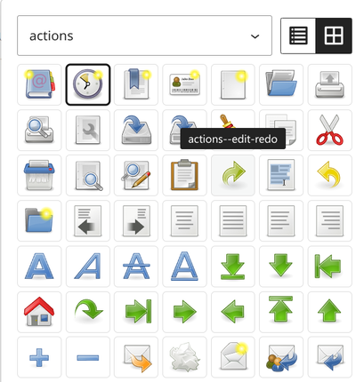

# Icon Library

Gutenberg plugin that inserts SVG icons from a central SVG sprite file (`ico.svg`) via `<use>` and links them. The sprite file can be uploaded directly from a settings page as an SVG fragment library.



## Features

- Settings page (Settings → Icon Library) for uploading the SVG sprite file, including sanitization of scripts and event handlers
- Symbol picker in the editor with a live preview of all `<symbol>` elements from the sprite
- Icons can be linked (new tab with `noopener`/`noreferrer`)
- Aria-label for screen readers
- Fill/stroke colours and width/height per block (`px`, `em`, `rem`, `%`)
- Dynamic frontend rendering via `render.php` using `get_block_wrapper_attributes()`
- Block supports: alignment, anchor, additional CSS classes

## Requirements

- WordPress >= 6.6
- PHP >= 8.3

## Installation

1. Upload the plugin folder to `/wp-content/plugins/` (or install the ZIP from a GitHub release)
2. Activate the plugin
3. Under **Settings → Icon Library**, upload the `ico.svg` file containing `<symbol id="my-icon" viewBox="0 0 24 24">…</symbol>` elements (or configure another source, see below)
4. In the editor, add the "SVG Fragment" block and choose an icon

Composer users should read [Composer installation](docs/composer-installation.md).

## Sprite file configuration

### Generating a sprite with svgforge-cli

To build a valid `ico.svg` sprite (with `<symbol id="…" viewBox="…">` elements) from a folder of SVG icons, use [svgforge-cli](https://github.com/svgforge/svgforge-cli/). The generated file can either be uploaded via the settings page or versioned as a theme file, see below.

The SVG sprite file is resolved in this order (the first existing source wins):

1. **Theme file** – Constant `ICON_LIBRARY_SPRITE_FILE`, when set **and** the file exists/is readable. **Has priority.**
2. **Upload from settings** – file uploaded via the settings page (overrides the default fallback and options 3–5).
3. **Constant `ICON_LIBRARY_SPRITE_URL`** – e.g. for CDN delivery.
4. **Filter `icon_library_sprite_url`**.
5. **Fallback `sprite.svg`** bundled with the plugin (`wp-content/plugins/icon-library/sprite.svg`).

### Theme file (recommended, Git-versionable)

In your theme's `functions.php`, point the constant to a local SVG file — the file then lives in the theme repo and is versioned with the theme:

```php
define( 'ICON_LIBRARY_SPRITE_FILE', get_stylesheet_directory() . '/assets/ico.svg' );
```

The file must be readable on the server and lie within `WP_CONTENT_DIR` (e.g. `wp-content/themes/…`) or `ABSPATH`; the matching URL is derived automatically. If the file does not exist, the next source (upload, constant, filter, fallback) is used.

### Other overrides

```php
// Constant (e.g. CDN) – before the filter, after upload/theme file
define( 'ICON_LIBRARY_SPRITE_URL', 'https://cdn.example.com/icons/ico.svg' );

// or filter
add_filter( 'icon_library_sprite_url', function () {
    return '/wp-content/themes/my-theme/assets/ico.svg';
} );
```

> Note: Constants must be defined **before** the first access (e.g. in the theme's `functions.php` or `wp-config.php`) and may only be set once in PHP.

## Documentation

Developer and maintenance topics are split into `docs/`:

- [Composer installation](docs/composer-installation.md) – install the plugin via Composer (GitHub repo or WP Packages)
- [Translations](docs/translations.md) – extract, translate and build the `languages/` files
- [Release & WordPress.org](docs/release.md) – automatic release workflow and publishing requirements
- [Development](docs/development.md) – build scripts, tests and project structure

## License

GPL-2.0-or-later, see [LICENSE](LICENSE).